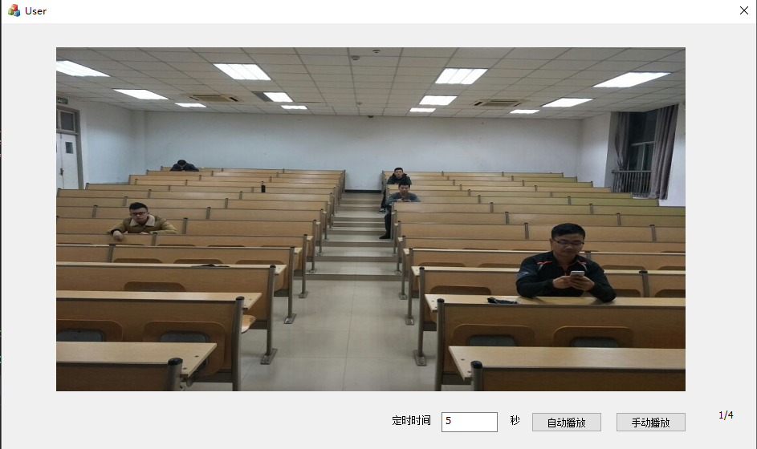

## Picture Player ##

> 根据MFC编写的一个在Picture控件中播放本地图片的项目，可实现手动播放和自动播放，主要用于一些实验环境类似于ppt的播放。

### 使用说明 ###
 * 基于MFC框架实现，windows中装有VC或者VS
 * 用CMake进行编译文件

### 操作步骤 ###
    https://github.com/yxlijun/PicturePlayer.git
    mkdir build
    cd build
    cmake ..

### 结果展示 ### 
  
